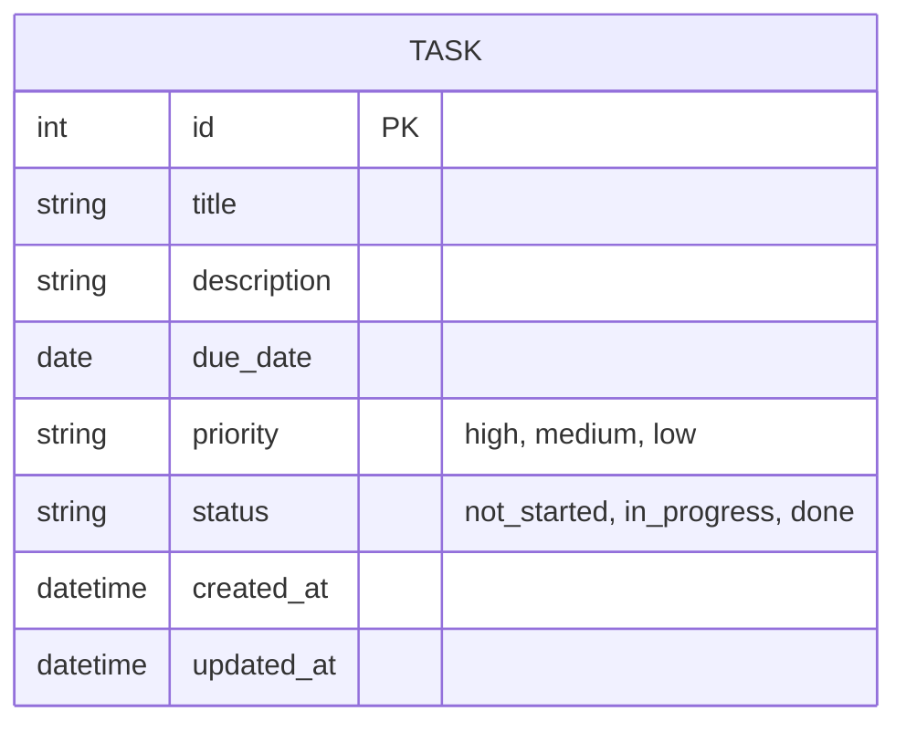

# データ設計(ER図)

親ドキュメント: [要件定義書](requirements.md)

現時点ではバックエンド・DBの技術構成(言語・フレームワーク・DBMS)はスクール講師の指定待ちのため未確定。そのため、特定のDB製品に依存しない論理レベルのER図として記載する。マルチユーザー非対応のため、エンティティは「タスク」1つのみ。

技術構成が決まり次第、テーブル定義(型・制約・インデックス等)を確定させる。

現状はサーバーやデータベースは用意せず、ブラウザ内にデータを保存する(localStorage)。将来的にバックエンド(自作)とDBを用意し、ブラウザ保存からDB保存へ切り替える予定。マルチユーザー対応は現時点では不要。
