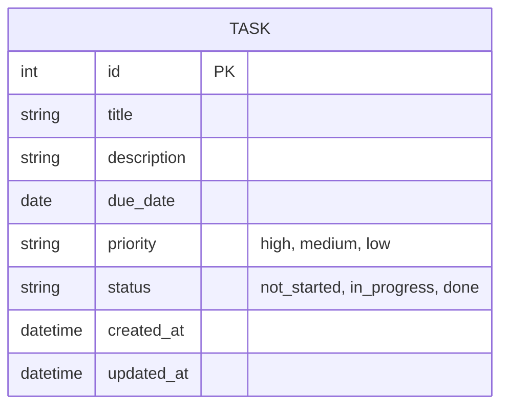

# データ設計(ER図)

親ドキュメント: [要件定義書](requirements.md)

バックエンドはJava / Spring Boot、DBはPostgreSQLを使用する予定(詳細は[技術スタック](tech-stack.md)を参照)。テーブル定義(型・制約・インデックス等)は今後確定させるため、現時点では特定のDB製品に依存しない論理レベルのER図として記載する。マルチユーザー非対応のため、エンティティは「タスク」1つのみ。

実装が進み次第、テーブル定義(型・制約・インデックス等)を確定させる。

現状はサーバーやデータベースは用意せず、ブラウザ内にデータを保存する(localStorage)。将来的にバックエンド(Java / Spring Boot)とDB(PostgreSQL)を用意し、ブラウザ保存からDB保存へ切り替える予定。マルチユーザー対応は現時点では不要。
