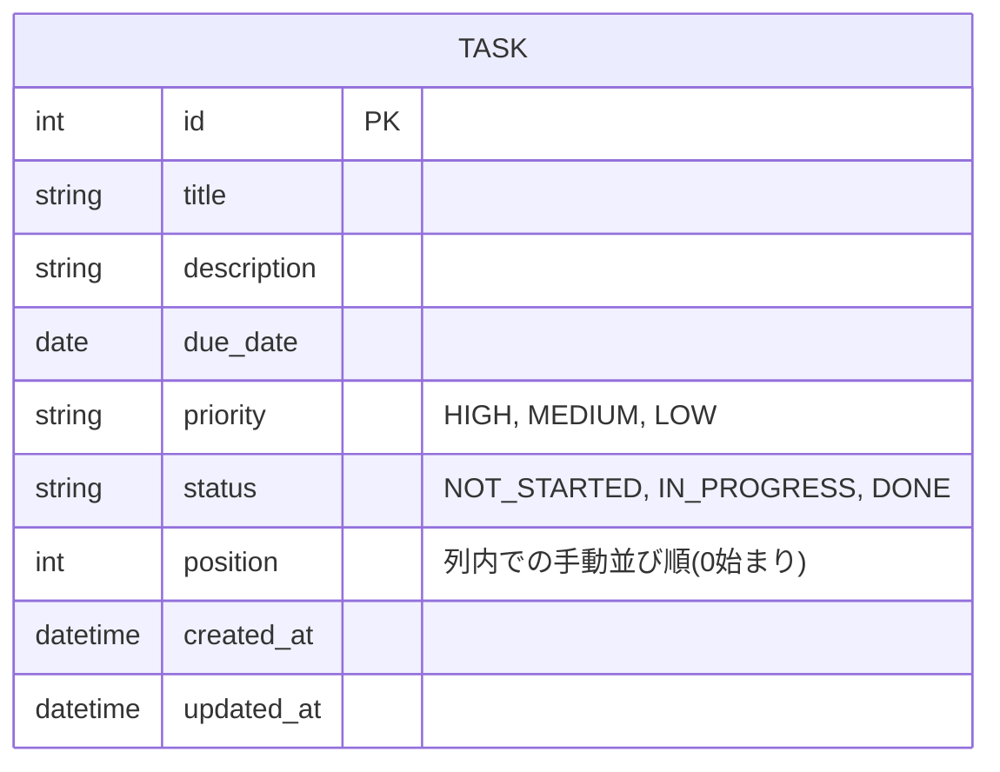

# データ設計(ER図)

親ドキュメント: [要件定義書](requirements.md)

バックエンドはJava / Spring Boot、DBはPostgreSQLを使用する(詳細は[技術スタック](tech-stack.md)を参照)。テーブル定義(型・制約・インデックス等)は特定のDB製品に依存しない論理レベルのER図として記載する。マルチユーザー非対応のため、エンティティは「タスク」1つのみ。

タスクはバックエンド(Java / Spring Boot)とDB(PostgreSQL)に保存される。フロントエンドはlocalStorage等ブラウザ内保存を使用せず、常にAPI経由でDBのデータを参照・更新する。マルチユーザー対応は現時点では不要。
