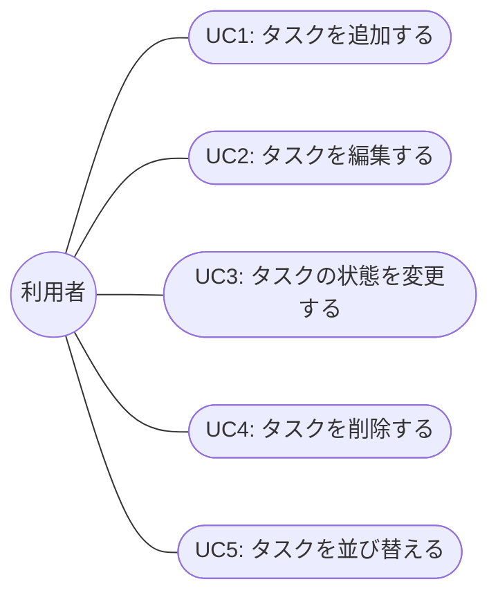

# 機能要件書

親ドキュメント: [要件定義書](requirements.md)

## 1. 機能一覧

| No | 機能 | 内容 |
|----|------|------|
| 1 | タスクの追加 | 「＋」ボタンからタスクを新規作成できる |
| 2 | タスクの状態変更 | タスクを「未着手」「進行中」「完了」の3つの列の間で移動できる |
| 3 | タスクの削除 | タスクを削除できる |
| 4 | タスクの保存 | ブラウザを閉じても入力内容が消えない(ブラウザへの保存機能を使う) |
| 5 | タスクの並び替え | 列ごとに「手動」「優先度順」「期限順」を切り替えられる。手動モードではカードをドラッグして自由な順序に並び替えられる |

## 2. タスクが持つ情報

| 項目 | 内容 |
|------|------|
| タイトル | タスクの名前 |
| 説明文 | タスクの詳細メモ |
| 期限 | 完了予定日 |
| 優先度 | 高・中・低の3段階 |
| 状態 | 未着手・進行中・完了のいずれか |
| 並び順 | 同じ列内での表示順を表す値。手動並び替え時に更新される |

## 3. ユースケース

対象アプリの利用者は「利用者本人」1人のみ(ログイン機能なし・個人利用)。以下、アクターは「利用者」と表記する。

### 3.1 ユースケース図

### 3.2 UC1: タスクを追加する

| 項目 | 内容 |
|------|------|
| アクター | 利用者 |
| 事前条件 | ボード画面を開いている |
| 事後条件 | 新しいタスクが「未着手」列に追加され、ブラウザに保存されている |
| 基本フロー | 1. 利用者が「＋」ボタンを押す 2. タスク追加モーダルが開く 3. 利用者がタイトル・説明文・期限・優先度を入力する 4. 利用者が「保存」を押す 5. モーダルが閉じ、ボード画面の「未着手」列にタスクカードが表示される |
| 代替フロー | 3a. 利用者が「キャンセル」を押す→モーダルが閉じ、タスクは追加されない 4a. タイトル未入力など必須項目が未入力の場合→保存できず、入力を促すメッセージを表示する |

### 3.3 UC2: タスクを編集する

| 項目 | 内容 |
|------|------|
| アクター | 利用者 |
| 事前条件 | ボード画面に編集対象のタスクカードが存在する |
| 事後条件 | タスクの内容(タイトル・説明文・期限・優先度)が更新され、ブラウザに保存されている |
| 基本フロー | 1. 利用者がタスクカードをクリックする 2. タスク編集モーダルが開き、現在の内容が表示される 3. 利用者が内容を変更する 4. 利用者が「保存」を押す 5. モーダルが閉じ、変更内容がボード画面に反映される |
| 代替フロー | 3a. 利用者が「キャンセル」を押す→モーダルが閉じ、変更は破棄される |

### 3.4 UC3: タスクの状態を変更する

| 項目 | 内容 |
|------|------|
| アクター | 利用者 |
| 事前条件 | ボード画面に対象のタスクカードが存在する |
| 事後条件 | タスクが選択した列(未着手/進行中/完了)に移動し、ブラウザに保存されている |
| 基本フロー | 1. 利用者がタスクカードを移動先の列へドラッグ&ドロップする(または移動操作を行う) 2. タスクの状態が移動先の列に応じて更新される 3. ボード画面の表示が更新される |
| 代替フロー | 1a. 同じ列内でのみ移動した場合→状態は変更されず、UC5(並び替え)としてその列内の順序が更新される |

### 3.5 UC4: タスクを削除する

| 項目 | 内容 |
|------|------|
| アクター | 利用者 |
| 事前条件 | ボード画面に削除対象のタスクカードが存在する |
| 事後条件 | タスクがボード画面から消え、ブラウザの保存データからも削除されている |
| 基本フロー | 1. 利用者がタスクカードをクリックし、タスク編集モーダルを開く 2. 利用者が「削除」を押す 3. タスクが削除され、モーダルが閉じる 4. ボード画面から該当のタスクカードが消える |
| 代替フロー | 2a. 誤操作防止のため削除前に確認ダイアログを表示する場合、利用者が確認を承認する→削除を実行する。キャンセルした場合は削除しない |

### 3.6 UC5: タスクを並び替える

| 項目 | 内容 |
|------|------|
| アクター | 利用者 |
| 事前条件 | ボード画面に対象の列とタスクカードが存在する |
| 事後条件 | 列内のタスクの表示順が更新され、ブラウザに保存されている |
| 基本フロー | 1. 利用者が列の「優先度順」または「期限順」ボタンを押す 2. その列のタスクが選択した基準で並び替えられ、対応するボタンが選択状態になる |
| 代替フロー | 1a. 利用者がタスクカードを同じ列内の別の位置へドラッグ&ドロップする→ドロップした位置に応じてカードの順序が更新され、その列の並び替えモードが自動的に「手動」に切り替わる 2a. 利用者が「手動」ボタンを押す→直近の手動並び順に戻る |
