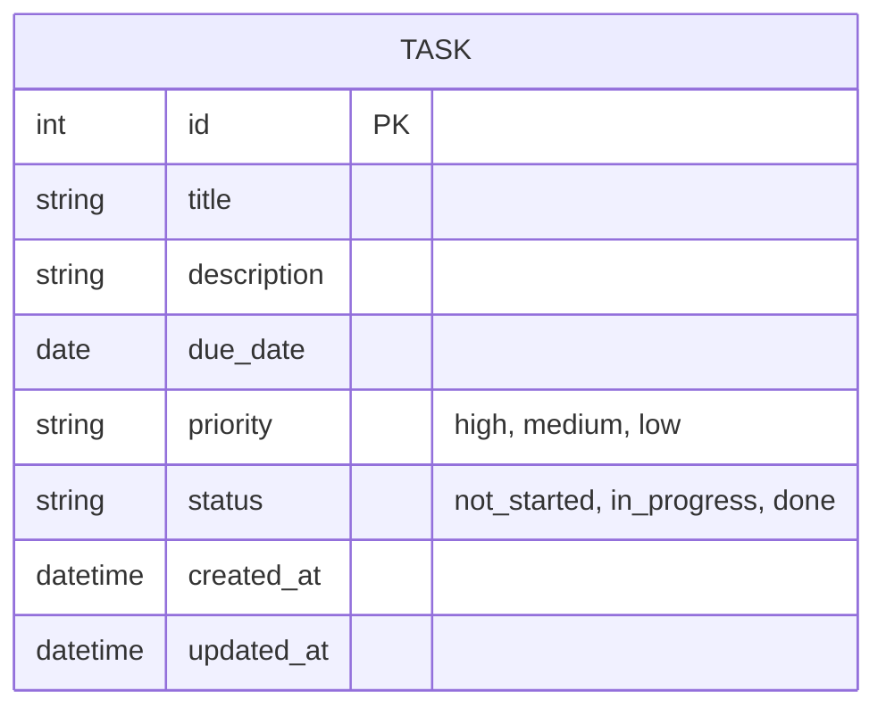
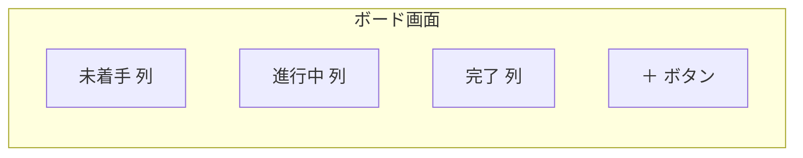
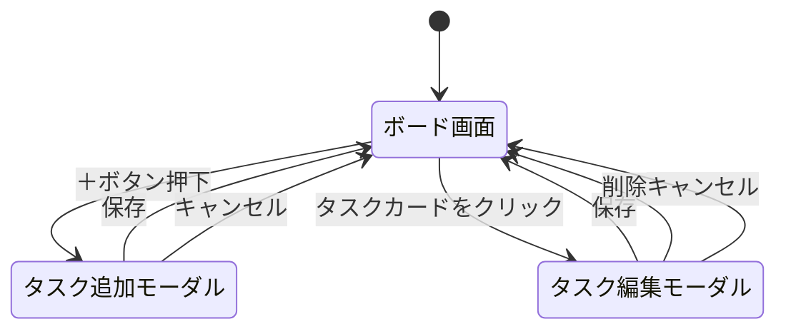
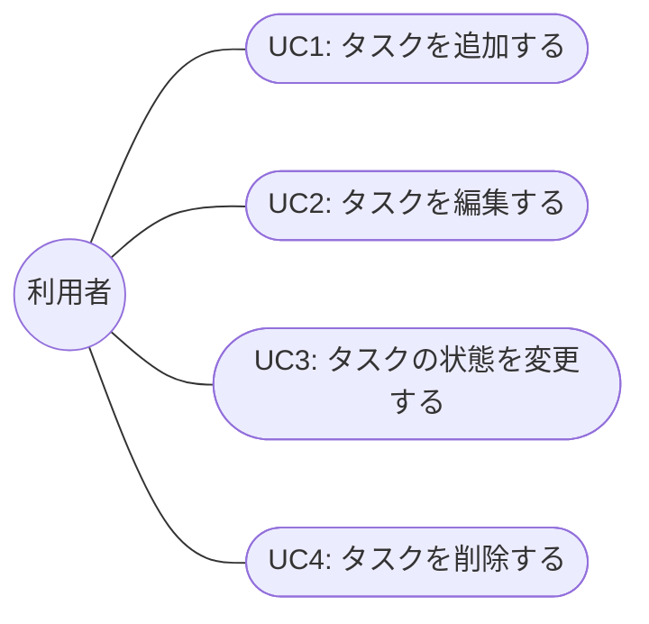

# 要件定義書

## 1. 概要・背景/目的

Trello風のタスク管理アプリ。個人利用を想定し、ログイン機能や複数人での共有は行わない。

**背景・目的**

本アプリはプログラミングスクールの学習課題として制作する。実務で使われるタスク管理アプリ(Trello等)を模したアプリを一人で企画・設計・実装することで、以下を習得することを目的とする。

- 要件定義〜設計〜実装〜(将来的な)DB連携までの一連の開発プロセスの経験
- フロントエンド(画面設計・状態管理)とバックエンド(API・DB設計)の基礎的な連携の理解
- ER図・画面遷移図など設計ドキュメントを自分で作成する経験

そのため、実際の顧客向けプロダクトではなく「学習目的で作る個人用アプリ」という前提で要件を定める。

## 2. 機能要件

| No | 機能 | 内容 |
|----|------|------|
| 1 | タスクの追加 | 「＋」ボタンからタスクを新規作成できる |
| 2 | タスクの状態変更 | タスクを「未着手」「進行中」「完了」の3つの列の間で移動できる |
| 3 | タスクの削除 | タスクを削除できる |
| 4 | タスクの保存 | ブラウザを閉じても入力内容が消えない(ブラウザへの保存機能を使う) |

## 3. タスクが持つ情報

| 項目 | 内容 |
|------|------|
| タイトル | タスクの名前 |
| 説明文 | タスクの詳細メモ |
| 期限 | 完了予定日 |
| 優先度 | 高・中・低の3段階 |
| 状態 | 未着手・進行中・完了のいずれか |

## 4. スコープ外(今回は作らない機能)

- ログイン機能
- 複数人での共有
- 期限切れタスクの強調表示など、期限に関する特別な表示(将来的に追加検討)

## 5. データの保存方法

現状はサーバーやデータベースは用意せず、ブラウザ内にデータを保存する(localStorage)。
将来的にバックエンド(自作)とDBを用意し、ブラウザ保存からDB保存へ切り替える予定(詳細は「7. データ設計(ER図)」を参照)。マルチユーザー対応は現時点では不要。

## 6. 優先度の初期値・並び順(補足)

保留。優先度は「高・中・低」の3段階とする。並び順や色分けなどの見た目の扱いは今後決定する。

## 7. データ設計(ER図)

現時点ではバックエンド・DBの技術構成(言語・フレームワーク・DBMS)はスクール講師の指定待ちのため未確定。そのため、特定のDB製品に依存しない論理レベルのER図として記載する。マルチユーザー非対応のため、エンティティは「タスク」1つのみ。

技術構成が決まり次第、テーブル定義(型・制約・インデックス等)を確定させる。

## 8. 画面設計・画面遷移

ボード画面1つのみを想定し、タスクの追加・編集はモーダルで行う(タスク詳細ページ等は作らない)。

### 8.1 画面構成(ボード画面)

- 未着手・進行中・完了の3列を横に並べて表示する
- 各列にその状態のタスクをカード形式で表示する
- タスクカードは列間をドラッグ&ドロップ、または操作(移動ボタン等)で移動できる
- 「＋」ボタンはボード画面上(列ごと、または画面共通)に配置する

### 8.2 画面遷移(モーダルの開閉)

## 9. 非機能要件(たたき台)

学習目的の個人アプリのため簡易な内容とする。今後の実装状況に応じて見直す。

| 項目 | 内容(たたき台) |
|------|----------------|
| 対応ブラウザ | 最新版の Google Chrome を主対象とする(他ブラウザは動作保証しない) |
| 想定データ量 | 保持タスク数は目安として最大100件程度を想定する |
| レスポンス速度 | タスクの追加・移動・削除などの操作は体感1秒以内に画面へ反映される |
| 稼働環境 | 個人のPC上での利用を想定し、常時稼働・可用性は考慮しない |
| データの永続化 | ブラウザを閉じても、または端末を再起動してもタスク情報が消えないこと(localStorage、将来的にはDB) |
| セキュリティ | ログイン機能なし・個人利用前提のため認証・認可は考慮しない。個人情報や機密情報は登録しないことを前提とする |
| 保守性 | 学習目的のため、コードの可読性を優先し、過度な最適化・抽象化は行わない |

## 10. スコープ外・保留事項

- 期限切れタスクの強調表示など、期限に関する特別な表示(将来的に追加検討)
- 優先度の初期値・並び順・色分け(6章、保留)
- 変更履歴・改訂管理(保留)

## 11. ユースケース

対象アプリの利用者は「利用者本人」1人のみ(ログイン機能なし・個人利用)。以下、アクターは「利用者」と表記する。

### 11.1 ユースケース図

### 11.2 UC1: タスクを追加する

| 項目 | 内容 |
|------|------|
| アクター | 利用者 |
| 事前条件 | ボード画面を開いている |
| 事後条件 | 新しいタスクが「未着手」列に追加され、ブラウザに保存されている |
| 基本フロー | 1. 利用者が「＋」ボタンを押す 2. タスク追加モーダルが開く 3. 利用者がタイトル・説明文・期限・優先度を入力する 4. 利用者が「保存」を押す 5. モーダルが閉じ、ボード画面の「未着手」列にタスクカードが表示される |
| 代替フロー | 3a. 利用者が「キャンセル」を押す→モーダルが閉じ、タスクは追加されない 4a. タイトル未入力など必須項目が未入力の場合→保存できず、入力を促すメッセージを表示する |

### 11.3 UC2: タスクを編集する

| 項目 | 内容 |
|------|------|
| アクター | 利用者 |
| 事前条件 | ボード画面に編集対象のタスクカードが存在する |
| 事後条件 | タスクの内容(タイトル・説明文・期限・優先度)が更新され、ブラウザに保存されている |
| 基本フロー | 1. 利用者がタスクカードをクリックする 2. タスク編集モーダルが開き、現在の内容が表示される 3. 利用者が内容を変更する 4. 利用者が「保存」を押す 5. モーダルが閉じ、変更内容がボード画面に反映される |
| 代替フロー | 3a. 利用者が「キャンセル」を押す→モーダルが閉じ、変更は破棄される |

### 11.4 UC3: タスクの状態を変更する

| 項目 | 内容 |
|------|------|
| アクター | 利用者 |
| 事前条件 | ボード画面に対象のタスクカードが存在する |
| 事後条件 | タスクが選択した列(未着手/進行中/完了)に移動し、ブラウザに保存されている |
| 基本フロー | 1. 利用者がタスクカードを移動先の列へドラッグ&ドロップする(または移動操作を行う) 2. タスクの状態が移動先の列に応じて更新される 3. ボード画面の表示が更新される |
| 代替フロー | 1a. 同じ列内でのみ移動した場合→状態は変更されない |

### 11.5 UC4: タスクを削除する

| 項目 | 内容 |
|------|------|
| アクター | 利用者 |
| 事前条件 | ボード画面に削除対象のタスクカードが存在する |
| 事後条件 | タスクがボード画面から消え、ブラウザの保存データからも削除されている |
| 基本フロー | 1. 利用者がタスクカードをクリックし、タスク編集モーダルを開く 2. 利用者が「削除」を押す 3. タスクが削除され、モーダルが閉じる 4. ボード画面から該当のタスクカードが消える |
| 代替フロー | 2a. 誤操作防止のため削除前に確認ダイアログを表示する場合、利用者が確認を承認する→削除を実行する。キャンセルした場合は削除しない |
