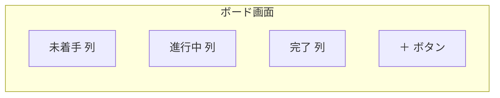
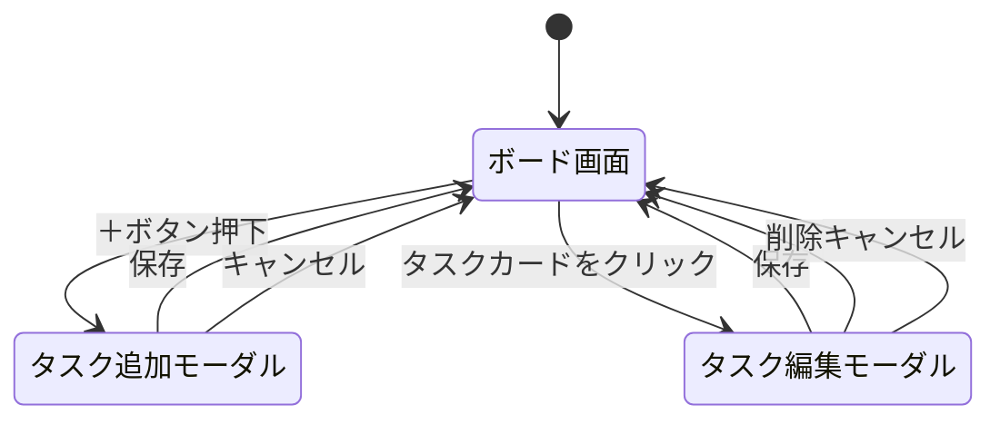

# 画面構成・画面遷移

親ドキュメント: [要件定義書](requirements.md)

ボード画面1つのみを想定し、タスクの追加・編集はモーダルで行う(タスク詳細ページ等は作らない)。

## 1. 画面構成(ボード画面)

- 未着手・進行中・完了の3列を横に並べて表示する
- 各列にその状態のタスクをカード形式で表示する
- タスクカードは列間をドラッグ&ドロップ、または操作(移動ボタン等)で移動できる
- 「＋」ボタンはボード画面上(列ごと、または画面共通)に配置する

## 2. 画面遷移(モーダルの開閉)

