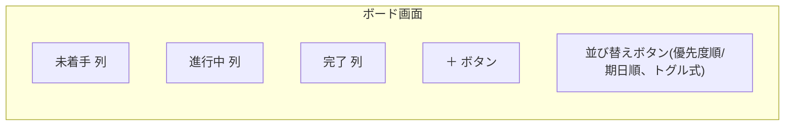
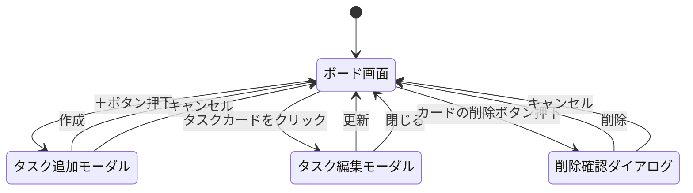

# 画面構成・画面遷移

親ドキュメント: [要件定義書](requirements.md)

ボード画面1つのみを想定し、タスクの追加・編集はモーダルで行う(タスク詳細ページ等は作らない)。

## 1. 画面構成(ボード画面)

- 未着手・進行中・完了の3列を横に並べて表示する
- 各列にその状態のタスクをカード形式で表示する
- タスクカードは列間をドラッグ&ドロップで移動できる
- 「＋」ボタンは画面共通(ヘッダー)に1つ配置し、新規タスクは常に「未着手」列に追加される
- 画面共通(ヘッダー)には、期限超過タスクのアラーム音をオン/オフ切り替えるミュートボタンを配置する
- 各列には「優先度順」「期日順」の並び替えボタンをトグル式で配置し、列ごとに独立して並び替え基準を選択できる。どちらも選択されていない状態が「手動」順で、ボタン押下時に選択中の同じボタンをもう一度押すと手動順に戻る
- 手動順の状態では、列内でタスクカードを直接ドラッグ&ドロップして自由な順序に並び替えられる(列間の移動と同じドラッグ操作で、同一列内に落とすと順序変更になり、その列の並び替えボタンは自動的にトグルOFF=手動順になる)
- タスクカード上には削除ボタン(🗑️)を配置し、確認ダイアログを経て直接削除できる(タスク編集モーダルを経由しない)

## 2. 画面遷移(モーダル・ダイアログの開閉)

